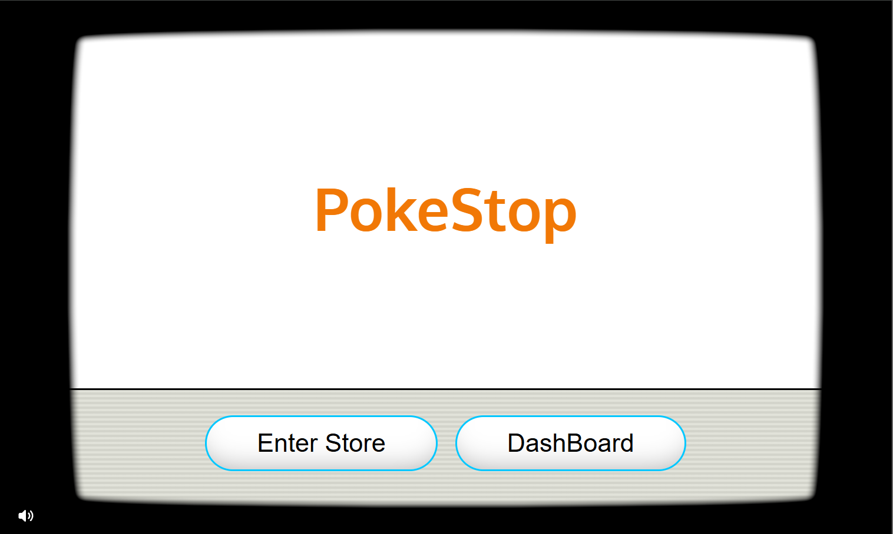
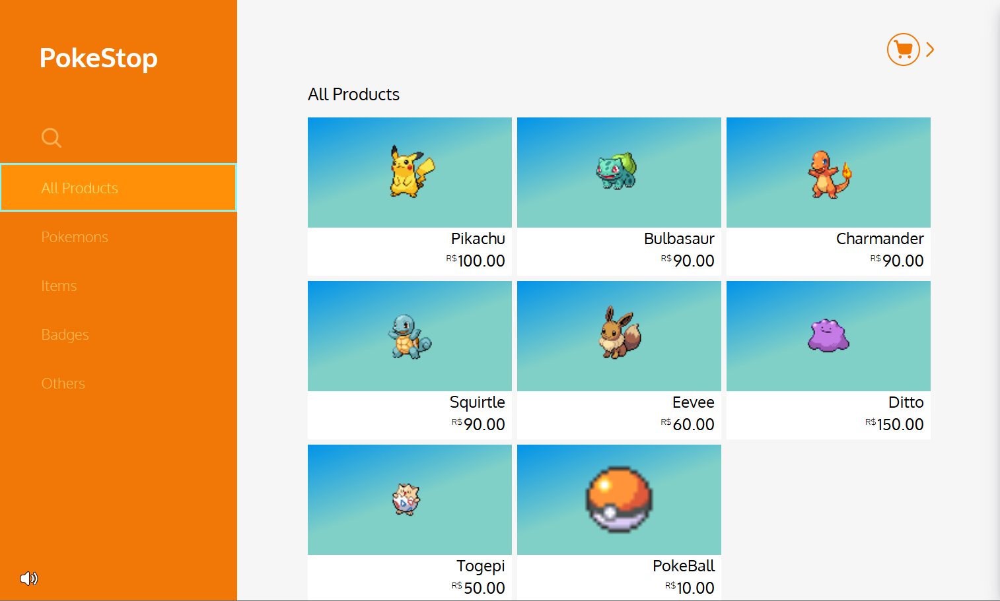
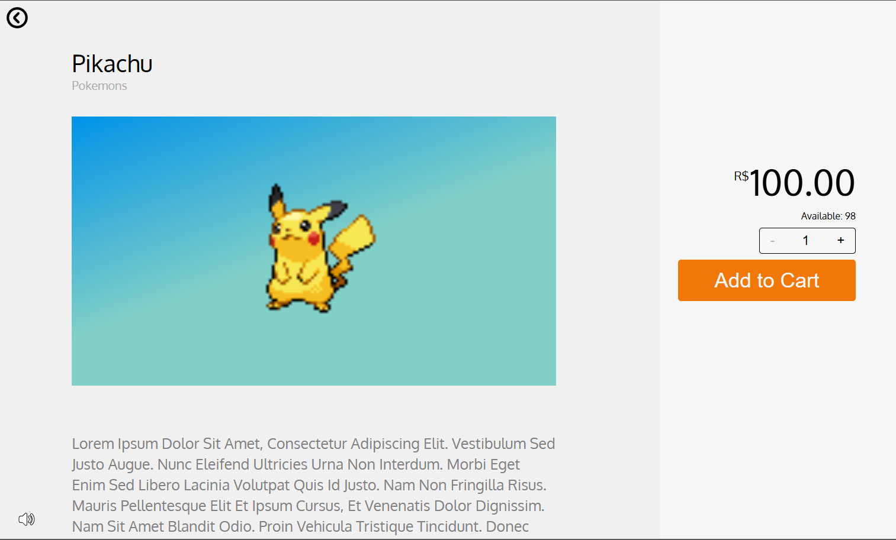
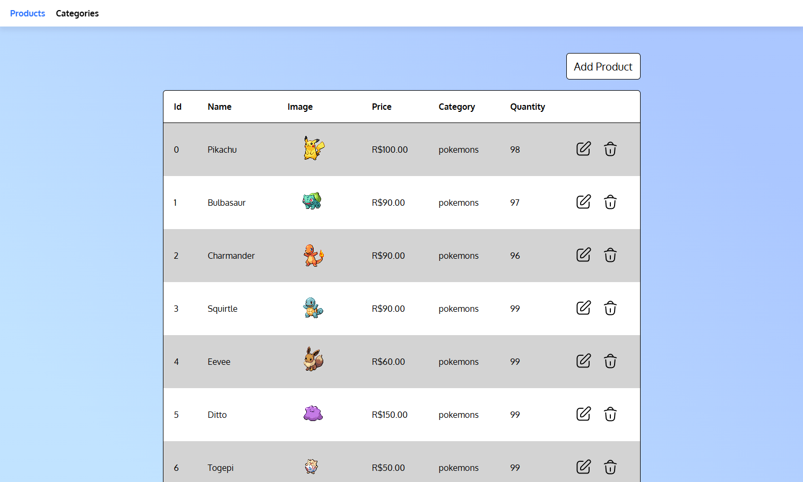
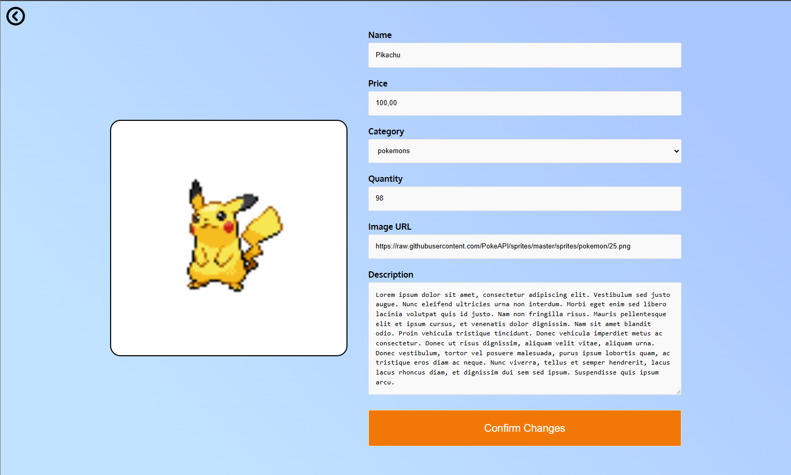
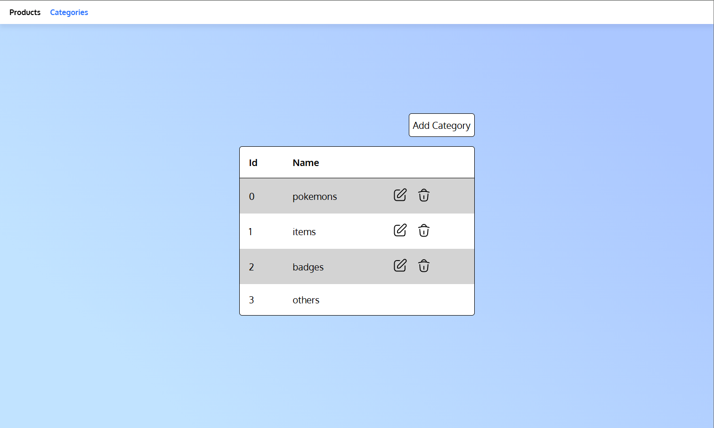
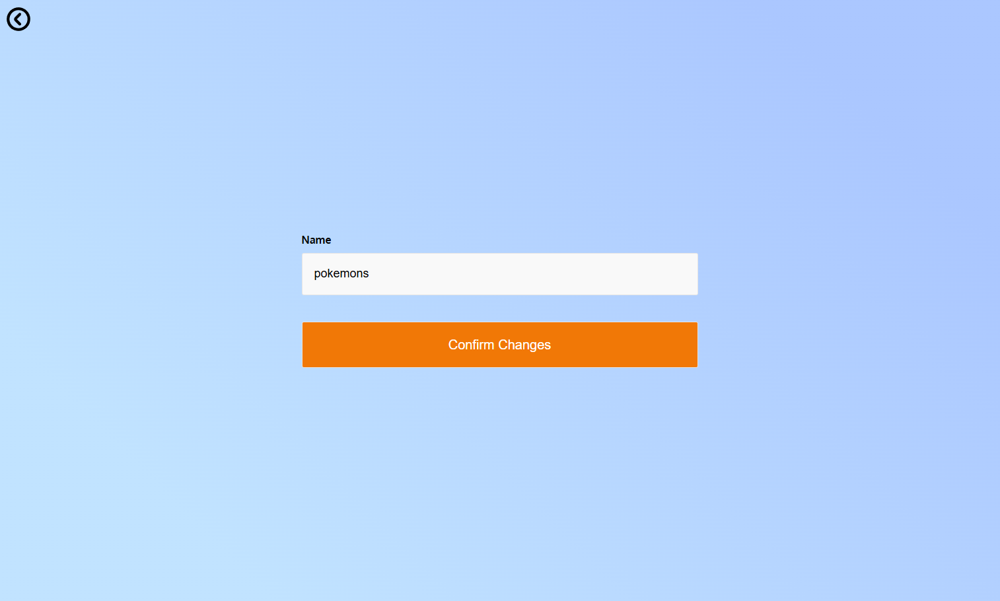

# PokeStop E-shop 🟠
This project was developed with the intention to create a functional virtual shop in Vite React, with comunication to an API simulated by the package ```json-server```.

The design made with CSS has the objective of simulating the UI of Nintendo systems e-shops, like the Switch and Wii. Also including background music to better fit the theme.

## 🖼️ Screenshots


*Home Page*


*Products Store Page*


*Detailed product page*


*Dashboard for editing, adding, and deleting products*


*Form page for editing and adding product*


*Dashboard for editing, adding, and deleting categories*


*Form page for editing and adding category*